# Sendible by Rdsign

This is an assessment project for Sendible. Was a cool experience, hope you like.
<br>

##### DESIGN

[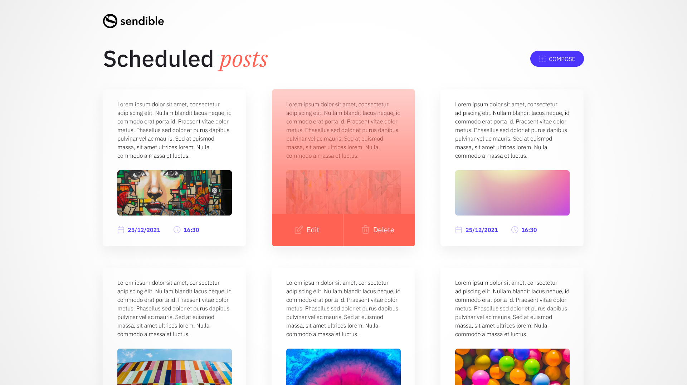](https://www.figma.com/file/KYlOWJhTJBZuklsd8qTBnh/SENDIBLE?node-id=1%3A2)
<br>

[https://www.figma.com/file/KYlOWJhTJBZuklsd8qTBnh/SENDIBLE?node-id=1%3A2](https://www.figma.com/file/KYlOWJhTJBZuklsd8qTBnh/SENDIBLE?node-id=1%3A2)
<br>
<br>
<br>

## :rocket: Features

#### :heart: Styled-components + Typescript

#### Syntax highlight and autofill for styling.
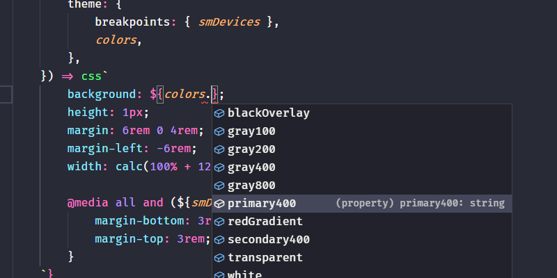
<br>

#### Styled theme types
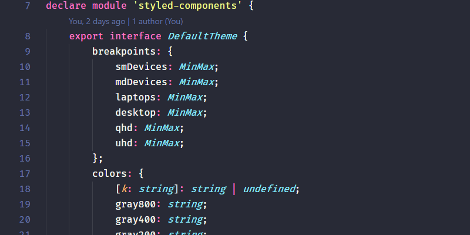
<br>

#### Theme file for our styles
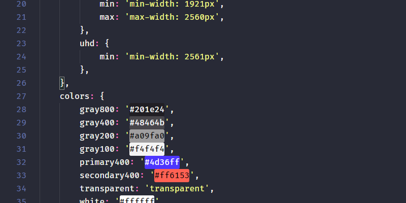
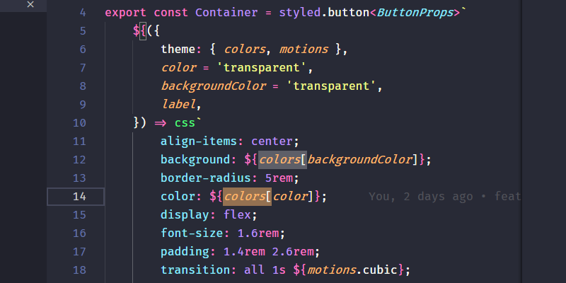
<br>
<br>

#### :muscle: Responsity + dynamic sizing

#### Better responsivity with dynamic screen size based on device.
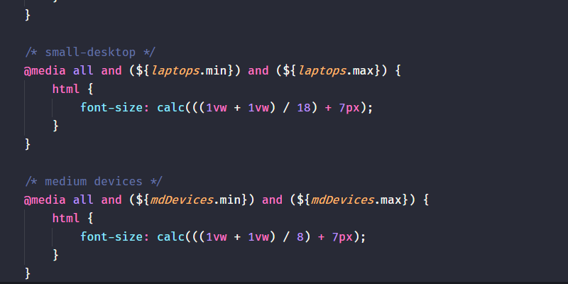
<br>

#### 1.6rem acts like 16px on FHD resolution. Better for dev experience.
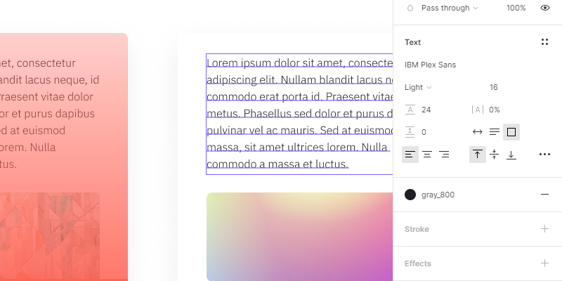
<br>

#### Better responsivity for every device. E.G.: Fixed compose button on devices
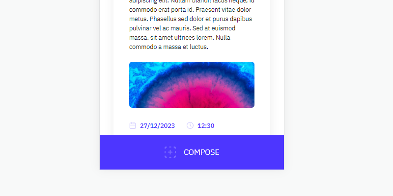
<br>
<br>

#### :file_folder: Image upload

#### Image upload
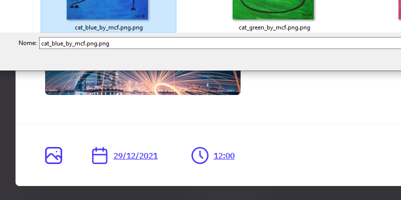
<br>

#### :warning: Post validations

#### Default date is set to next day, 12:00 on new posts and included validations
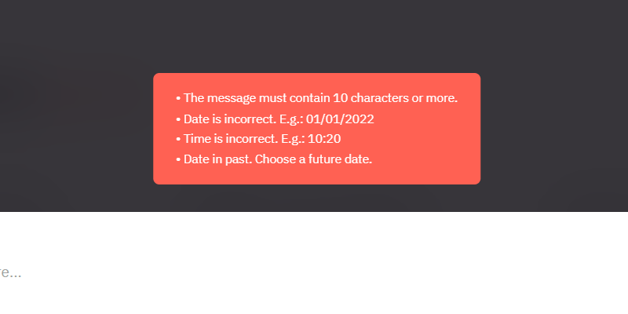
<br>

#### Input masks
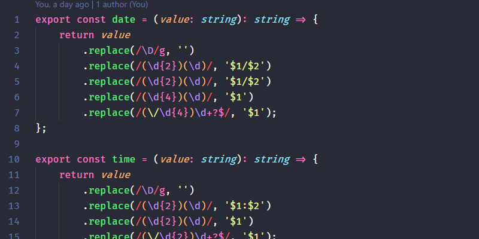
<br>

#### :fire: Tests

#### Components tested
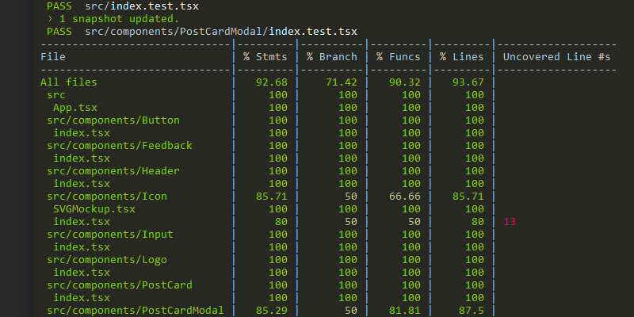
<br>

## :computer: Dependencies

-   npm 7.6.2+
-   Nodejs 12+
-   Yarn 1.22.10+

<br>
<br>
<br>

## :clipboard: Commands

### Install dependencies

```
yarn
```

### Run in dev mode

```
yarn dev
```

### Run build

```
yarn build
```

### Run tests

```
yarn test
```
